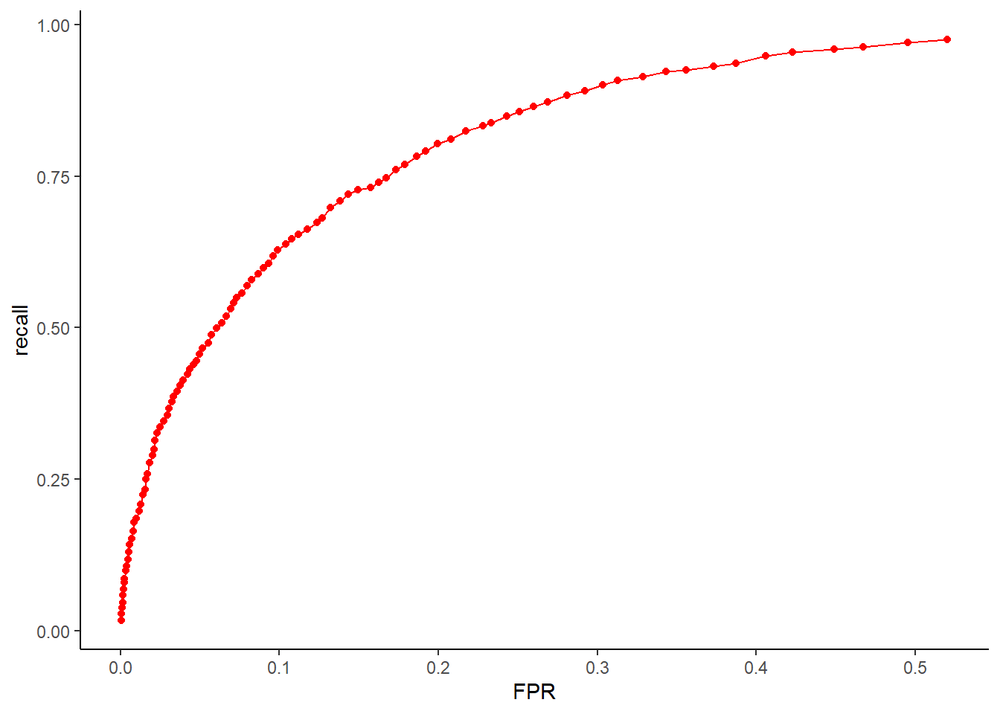
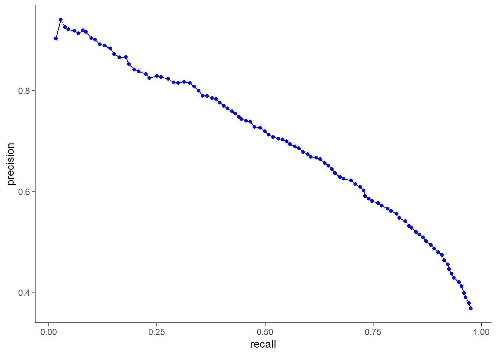

## 1. Tool Overview

The m6APrediction is an R package for bioinformatics research. It is a machine learning-based tool designed to rapidly and accurately predict N6-methyladenosine (m6A) modification sites in RNA sequences, integrating features like GC content, RNA type, RNA region, and DNA 5mer sequences. For detailed usage, examples, and parameter specifications, see the package documentation or run ?m6ASitePred in the R console.


## 2. Installation
Install the package directly from GitHub using `devtools` or `remotes` (ensure you have these packages installed first):

```{r, eval=FALSE}
# Install devtools if not available
if (!requireNamespace("devtools", quietly = TRUE)) {
  install.packages("devtools")
}

# Install m6APrediction from GitHub
devtools::install_github('Willy-BioIn/m6APrediction')

#or use remote

remotes::install_github('Willy-BioIn/m6APrediction')
```


## 3. Minimal Usage Example
Load the package and use the two core prediction functions with pre-trained models and example data:
```{r, eval=FALSE}
library(m6APrediction)

#prediction_multiple
rf_fit <- readRDS(system.file("extdata", "rf_fit.rds", package = "m6APrediction"))
feature_df <-read.csv(system.file("extdata", "m6A_input_example.csv", package = "m6APrediction"))

result_multiple<-prediction_multiple(ml_fit = rf_fit, feature_df = feature_df)
head(result_multiple,3)

#prediction_single

result_single<-prediction_single(
ml_fit = rf_fit,
gc_content = 0.6,
RNA_type = "mRNA",
RNA_region = "3'UTR",
exon_length = 12,
distance_to_junction = 5,
evolutionary_conservation = 0.7,
DNA_5mer = "ATCGT",
positive_threshold = 0.5)

print(result_single)


```

## 4. Model Performance

The model shows strong predictive power, as demonstrated by the ROC (Receiver Operating Characteristic) and PRC (Precision-Recall Curve) below:


```{r echo=FALSE, out.width="80%"}
### ROC Curve



### PRC Curve


```

